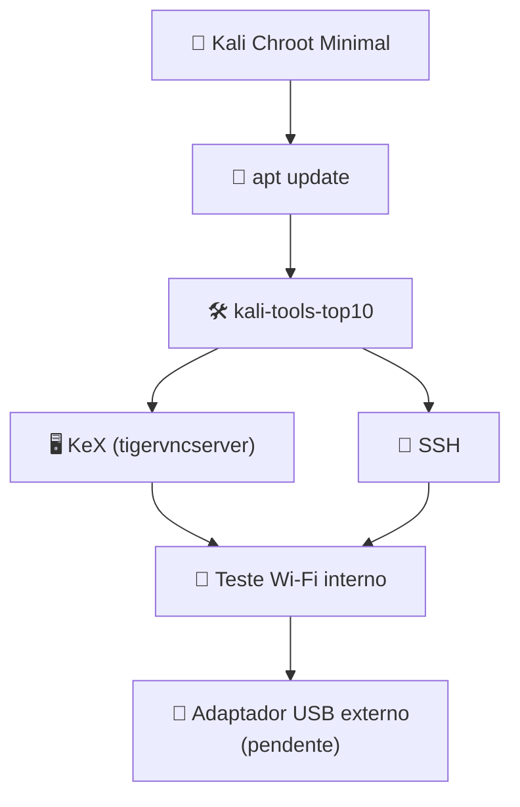

# Android + LineageOS + Magisk + Kali NetHunter — Redmi Note 10S (rosemary/secret)

> Guia reconstruído a partir do procedimento efetivamente utilizado para desbloquear o bootloader, instalar **LineageOS 23.2 (Android 16) + Magisk 30.7 + Kali NetHunter + Kali Chroot Minimal** no **Xiaomi Redmi Note 10S (`rosemary`/`secret`)**.
>
> Estrutura e metodologia baseadas no guia original [xiaomi-mi9-lite-kali-nethunter](https://github.com/peotta/xiaomi-mi9-lite-kali-nethunter) de [@peotta](https://github.com/peotta), adaptado com os dados e resultados reais deste aparelho.
>
> Desbloqueio do bootloader realizado com [mtkclient](https://github.com/bkerler/mtkclient) de [@bkerler](https://github.com/bkerler).
>
> **IMPORTANTE:** este guia é específico para o Redmi Note 10S (M2101K7BI, variante Índia). Arquivos, partições e comandos de flash não devem ser reaproveitados em outro modelo sem confirmar antes o codinome, o esquema de partições e a build exata do aparelho de destino.

---

## 1. Resultado final obtido

Ao final do procedimento, a configuração ficou assim:

- Xiaomi Redmi Note 10S, modelo M2101K7BI (Índia)
- Codinome de board: `secret` (família `rosemary`)
- Chipset: MediaTek Helio G95 (MT6785)
- Bootloader desbloqueado
- Android 16
- LineageOS 23.2 (nightly)
- Magisk 30.7
- Root funcional
- Kali NetHunter instalado
- Kali Chroot **Minimal**
- Kali Linux Rolling
- `kali-tools-top10`
- NetHunter KeX (via tigervncserver, sem depender do script `kex` do WSL)
- SSH (via cabo/ADB forward e via Wi-Fi direto)
- interface `mon0` **não pôde ser criada** no Wi-Fi interno
- limitação total do driver MediaTek (vendor fechado, compilado no kernel, confirmada via `nl80211` e `ioctl`) para monitor mode
- recomendação de adaptador Wi-Fi USB externo para monitor mode/injection

---

## 2. Por que escolhemos o Kali Minimal

Um dos pontos mais importantes do procedimento foi **não instalar imediatamente uma imagem Kali muito grande**.

No NetHunter Chroot Manager escolhemos:

```
Install
Download Latest
Minimal
```

Vantagens dessa abordagem:

1. menor espaço ocupado no armazenamento;
2. instalação mais rápida e com menos pontos de falha;
3. menos pacotes para atualizar de início;
4. mais fácil identificar problemas em cada camada;
5. possibilidade de adicionar ferramentas gradualmente, conforme a necessidade.

### O que evitamos logo após a instalação

Não executamos de imediato `apt full-upgrade`, `apt dist-upgrade`, nem metapacotes como `kali-linux-full` ou `kali-linux-everything`.



---

## 3. Ambiente e dados do aparelho

```
Fabricante: Xiaomi
Modelo: Redmi Note 10S
Modelo comercial: M2101K7BI (variante Índia)
Codinome (board): secret
Família de codinome: rosemary (rosemary=NFC, secret=sem NFC, maltose=LatAm — mesmo hardware)
Chipset: MediaTek Helio G95 (MT6785)
Arquitetura: ARM64
ROM original: MIUI Global 14.0.11.0 (TKLINXM), Android 13, kernel 4.14.186-perf
Bootloader desbloqueável: sim
Esquema A/B: sim (partições _a / _b — slot ativo confirmado como b após o unlock)
Recovery: Lineage Recovery (após troca de ROM)
USB OTG: sim
Suporte NetHunter/kernel: sem kernel dedicado — via Kali Chroot Minimal
```

### Computador

```
Debian Linux
ADB / Fastboot (com sudo em vez de regra udev)
```

### Software utilizado

- LineageOS 23.2 (nightly, `rosemary`)
- Android 16
- Magisk 30.7
- Kali NetHunter (`com.offsec.nethunter`) + NetHunter Terminal (`com.offsec.nhterm`)
- Kali Linux Rolling

### Arquivos utilizados

```
lineage-23.2-20260826-nightly-rosemary-signed.zip
dtbo.img
lk.img
boot.img (Lineage Recovery)
Magisk-v30.7.apk
com.offsec.nethunter_2026061000.apk
com.offsec.nhterm_2026010400.apk
```

> O pacote do LineageOS vem em formato **payload.bin** (OTA/Brunch), não com `boot.img` solto no zip — é preciso extrair com `payload-dumper-go` antes de patchar com o Magisk (ver seção 15).

---

## 4. Pré-requisitos

- backup dos dados do celular;
- bateria carregada;
- cabo USB confiável (cabos "só carga" causam falhas silenciosas de detecção em modo Fastboot);
- ADB e Fastboot funcionando no Debian;
- todos os arquivos necessários numa única pasta de trabalho.

Estrutura usada no PC:

```
~/Área de trabalho/kali_celular/
├── dtbo.img
├── lk.img
├── boot.img
├── lineage-23.2-20260826-nightly-rosemary-signed.zip
├── Magisk-v30.7.apk
├── com.offsec.nethunter_2026061000.apk
└── com.offsec.nhterm_2026010400.apk
```

---

## 5. Desbloqueio do bootloader

Explora uma falha do bootrom MediaTek (*Kamakiri*) para gravar o desbloqueio direto na partição `seccfg`, sem esperar o prazo padrão de 7 dias da Xiaomi. ⚠️ Apaga todos os dados.

```bash
# Dependências
sudo apt update
sudo apt install -y git python3 python3-pip python3-pycryptodome python3-usb python3-serial python3-tabulate libusb-1.0-0-dev fastboot adb

# Clonar e preparar
git clone https://github.com/bkerler/mtkclient.git
cd mtkclient
pip3 install -r requirements.txt --break-system-packages
pip3 install colorama --break-system-packages

# Permissões USB
echo 'SUBSYSTEM=="usb", ATTR{idVendor}=="0e8d", MODE="0666", GROUP="plugdev"' | sudo tee /etc/udev/rules.d/50-mtk.rules
sudo udevadm control --reload-rules
sudo udevadm trigger
sudo usermod -aG plugdev $USER

# Executar o bypass
python3 mtk.py da seccfg unlock
# Com "Waiting for device...": desligar o celular, segurar Volume + e Volume -
# simultaneamente, e só então conectar o cabo USB.

# Validar e formatar
fastboot getvar unlocked        # esperado: unlocked: yes
fastboot erase userdata
fastboot erase cache
fastboot reboot
```

O aparelho exibe um cadeado aberto na tela de boot, confirmando o desbloqueio.

---

## 6. Verificar a comunicação ADB

```bash
sudo adb devices
```

Esperado:
```
List of devices attached
WGLNQ4PRDQBQ45MV    device
```

---

## 7. Confirmar o modelo e a variante exata

```bash
sudo fastboot getvar product
```

Retornou `secret` → confirma a variante Índia (sem NFC), família `rosemary`. Isso define qual página do wiki do LineageOS seguir (`variant1`).

---

## 8. Gravar partições adicionais (dtbo / lk)

```bash
cd ~/'Área de trabalho'/kali_celular
sudo fastboot devices
sudo fastboot flash dtbo dtbo.img
sudo fastboot flash lk lk.img
sudo fastboot reboot bootloader
```

> Repare que as partições são gravadas com sufixo `_b` automaticamente — esquema A/B, comportamento normal.

---

## 9. Instalar a Lineage Recovery

```bash
sudo fastboot flash boot boot.img
```

Para entrar na recovery de forma confiável (o combo físico Volume Up + Power pode não funcionar em alguns MediaTek):

```bash
sudo fastboot reboot recovery
```

Confirme visualmente o logo do LineageOS (não o "Mi Recovery" da MIUI).

---

## 10. Factory reset e sideload do LineageOS

Dentro da Lineage Recovery (interface por toque):

```
Factory reset
    ↓
Format data / factory reset
    ↓
(voltar ao menu)
    ↓
Apply update
    ↓
Apply from ADB
```

No PC:

```bash
sudo adb devices
sudo adb -d sideload lineage-23.2-20260826-nightly-rosemary-signed.zip
```

Ao terminar, escolher **"No"** para pacotes adicionais (GApps) e **Reboot system now**.

---

## 11. Primeiro boot do LineageOS

Configuração inicial padrão do Android. Confirme em **Configurações → Sobre o telefone** a versão instalada antes de prosseguir para o root.

---

## 12. Ativar Depuração USB no LineageOS

```
Configurações → Sobre o telefone → Número da versão (toque ~7x)
    ↓
Opções do desenvolvedor → Depuração USB
```

```bash
sudo adb devices
```

---

## 13. Instalar o Magisk

```bash
sudo adb install Magisk-v30.7.apk
```

---

## 14. Extrair o boot.img correto do pacote OTA

O pacote do LineageOS usa o formato `payload.bin` (não há `boot.img` solto no zip):

```bash
sudo apt install xz-utils -y
wget https://github.com/ssut/payload-dumper-go/releases/download/2.0.2/payload-dumper-go_2.0.2_linux_amd64.tar.gz
tar -xvzf payload-dumper-go_2.0.2_linux_amd64.tar.gz
./payload-dumper-go -p boot -o boot_extraido lineage-23.2-20260826-nightly-rosemary-signed.zip
```

Isso gera `boot_extraido/boot.img`.

---

## 15. Corrigir a imagem de boot com o Magisk

```bash
sudo adb push boot_extraido/boot.img /sdcard/Download/
```

No app Magisk: **Instalar → Selecionar e corrigir um arquivo → Download/boot.img**. Gera `magisk_patched-30700_xxxxx.img` na mesma pasta.

---

## 16. Copiar e gravar o boot corrigido

```bash
sudo adb pull /sdcard/Download/
sudo fastboot devices
sudo fastboot flash boot Download/magisk_patched-30700_xxxxx.img
sudo fastboot reboot
```

---

## 17. Confirmar o root

```bash
sudo adb shell su -c id
```

Esperado:
```
uid=0(root) gid=0(root) groups=0(root) context=u:r:magisk:s0
```

---

## 18. Instalar o Kali NetHunter

Usar os APKs **oficiais** da loja `store.nethunter.com` — evitar apps de terceiros com nome parecido (ex. "Kali Shell" da F-Droid, que não integra com o Magisk):

```bash
sudo adb install com.offsec.nethunter_2026061000.apk
```

Abrir o app, conceder root quando o Magisk pedir.

---

## 19. Instalar o Kali Chroot Minimal

```
NetHunter → menu ☰ → Kali Chroot Manager → Install → Download Latest → Minimal
```

Aguardar a extração completa sem interromper.

---

## 20. Instalar e configurar o terminal (NetHunter Terminal)

```bash
sudo adb install com.offsec.nhterm_2026010400.apk
```

Esse app aparece no launcher como **"Kali Shell"** — é o app oficial correto (pacote `com.offsec.nhterm`), apesar do nome parecer o de um app genérico de terceiros.

Se a sessão não permitir digitar ou fechar com "code 1": confirmar em **Magisk → Superuser** que o NetHunter Terminal tem acesso root concedido, e abrir uma **"New Root Shell"**, entrando manualmente no chroot com:

```bash
su
bootkali
```

---

## 21. Testar o chroot

```bash
whoami                  # esperado: root
cat /etc/os-release     # esperado: Kali GNU/Linux Rolling
```

---

## 22. Testar conectividade antes de atualizar

```bash
ip addr
ping -c 4 kali.org
```

---

## 23. Atualizar os índices de repositório

```bash
apt update
```

---

## 24. Instalar um conjunto controlado de ferramentas

Em vez de `kali-linux-full`/`kali-linux-everything`:

```bash
apt install kali-tools-top10 -y
```

Inclui nmap, metasploit-framework, burpsuite, wireshark, aircrack-ng, john, hydra, sqlmap, nikto, gobuster, entre outros. Espaço livre no aparelho no momento: 101G de 109G — sem restrição.

---

## 25. Ambiente gráfico (KeX) — adaptado

O script `kex` do pacote `kali-win-kex` é feito para o WSL (Windows) e falha no Android (erros de `route.exe`, `mstsc.exe` etc. são apenas ruído, mas o servidor VNC de fato não sobe pelo script). A solução foi usar o `tigervncserver` diretamente:

```bash
apt install dbus-x11 -y

printf '#!/bin/sh\nunset SESSION_MANAGER\nunset DBUS_SESSION_BUS_ADDRESS\nexec dbus-launch --exit-with-session startxfce4\n' > ~/.vnc/xstartup
chmod +x ~/.vnc/xstartup

tigervncserver :1
```

No celular, no app **NetHunter KeX**: conectar em `127.0.0.1:5901` com a senha definida na primeira execução. Resultado: desktop XFCE completo.

---

## 26. Configurar SSH

```bash
apt update
apt install openssh-server -y
ssh-keygen -A
passwd
/usr/sbin/sshd
ss -tlnp | grep :22
```

---

## 27. Acessar o Kali via SSH pelo cabo USB (ADB forward)

```bash
sudo adb forward tcp:2222 tcp:22
ssh root@127.0.0.1 -p 2222
```

---

## 28. Acessar o Kali via SSH pela rede Wi-Fi (sem cabo)

Com o celular e o PC na mesma rede:

```bash
ssh root@192.168.1.17
```

*(IP obtido via `ip addr` dentro do chroot — muda conforme a rede)*

> **Sobre desconectar o cabo USB:** é seguro em qualquer momento, mas o efeito depende do serviço em uso — KeX aberto pelo próprio celular continua rodando; KeX/VNC espelhado no PC via cabo encerra a transmissão; terminal via SSH com `adb forward` cai imediatamente (a ponte TCP dependia do cabo). Para seguir sem cabo, manter o `sshd` ativo e conectar pelo IP Wi-Fi.

---

## 29. Inspecionar as interfaces Wi-Fi

```bash
iw dev
iw list
ip addr
```

Interfaces encontradas: `wlan0` (managed, conectada à rede), `wlan1`, `p2p0`, `ap0`. Na saída do `iw list`, a seção **"Supported interface modes"** do `phy0` lista apenas: `IBSS`, `managed`, `AP`, `P2P-client`, `P2P-GO`.

---

## 30. Tentar criar uma interface de monitoramento

```bash
iw phy phy0 interface add mon0 type monitor
```

Resultado obtido:
```
command failed: Operation not supported (-95)
```

### 30.1. Investigação adicional do driver

Para descartar outras causas (interface ocupada, limite de combinação, API errada) antes de considerar definitivo:

```bash
cat /proc/modules
cat /sys/class/net/wlan0/device/modalias
ls /sys/module/ | grep -i -E "wlan|wifi|mt76|mt79|connac|cfg80211"
```

Resultados:
- `/proc/modules` **vazio** → o driver de Wi-Fi não é um módulo carregável, está **compilado direto no kernel** (típico de kernel vendor da Xiaomi/MediaTek — não dá pra trocar ou atualizar sem recompilar o kernel).
- `modalias` retornou `of:NwifiT<NULL>Cmediatek,wifi` → nome genérico do device tree, sem identificar o chip exato (nada como `mt7663`/`mt7961`) — confirma que **não é** o driver aberto `mt76`.
- `/sys/module/` só lista `cfg80211` (pilha genérica do kernel) — nenhum módulo específico do driver, porque ele nem existe como módulo separado.

### 30.2. Confirmação via API legada (ioctl)

Para eliminar a hipótese de ser só uma limitação da API `nl80211`:

```bash
apt install wireless-tools -y
iwconfig wlan0 mode monitor
```

Resultado:
```
Error for wireless request "Set Mode" (8B06) :
    SET failed on device wlan0 ; Operation not supported.
```

Mesmo erro (`Operation not supported`) pelas duas APIs — confirma que a limitação é do próprio driver do kernel, não de interface ocupada, nem de método de chamada.

---

## 31. Limitação do Wi-Fi interno deste aparelho

Diferente do estudo de caso original (Mi 9 Lite/Qualcomm), onde a interface `mon0` **chegava a ser criada** (falhando só depois, no uso com `airodump-ng`), neste Redmi Note 10S o driver vendor MediaTek (fechado, compilado direto no kernel) **nem permite criar a interface monitor**, por nenhuma das duas APIs testadas (`nl80211` e `ioctl` legado). O modo `monitor` nem aparece na lista de capacidades suportadas pelo `phy0`.

> **Kali funcionando não significa hardware Wi-Fi liberado para monitor mode.** A limitação é do driver/kernel do fabricante, não do Kali Chroot em si — e como o driver está compilado dentro do kernel (não é módulo, não é `mt76`), não há como contornar via software sem recompilar o kernel do aparelho.

---

## 32. Alternativa: adaptador Wi-Fi USB externo

Para monitor mode/injection reais, a via recomendada é um adaptador Wi-Fi USB compatível via OTG:

| Adaptador | Chipset |
|---|---|
| ALFA AWUS036NHA | Atheros AR9271 |
| TP-Link TL-WN722N **v1** (apenas a v1) | Atheros AR9271 |
| ALFA AWUS036ACH | RTL8812AU |

```bash
airmon-ng start wlan1
airodump-ng wlan1mon
```

Use apenas em redes e equipamentos próprios ou com autorização expressa.

---

## 33. Comandos de diagnóstico úteis

### Android / ADB
```bash
sudo adb devices
sudo adb shell
sudo adb reboot bootloader
sudo adb push / sudo adb pull
sudo adb forward
```

### Fastboot
```bash
sudo fastboot devices
sudo fastboot getvar unlocked
sudo fastboot getvar current-slot
sudo fastboot getvar product
sudo fastboot flash boot magisk_patched-30700_xxxxx.img
sudo fastboot reboot
```

### Kali
```bash
whoami
cat /etc/os-release
apt update
ip addr
iw dev
iw list
ss -tlnp
```

---

## 34. Checklist de validação

- [x] ADB reconhece o aparelho
- [x] Fastboot reconhece o aparelho
- [x] Bootloader desbloqueado
- [x] Lineage Recovery inicializa
- [x] LineageOS instala por sideload
- [x] Android inicia normalmente na versão esperada
- [x] Depuração USB habilitada
- [x] Magisk instalado
- [x] `boot.img` extraído do payload.bin
- [x] Magisk gera `magisk_patched`
- [x] Fastboot grava o boot corrigido
- [x] `adb shell su -c id` retorna root
- [x] NetHunter instalado, permissão root concedida
- [x] Kali Chroot Minimal instalado e iniciado
- [x] `apt update` funciona
- [x] `kali-tools-top10` instalado
- [x] KeX funcional (via tigervncserver)
- [x] SSH funcional (cabo e Wi-Fi)
- [x] Interfaces Wi-Fi identificadas
- [x] Limitação do Wi-Fi interno confirmada e documentada
- [ ] Adaptador Wi-Fi USB externo (pendente de compra)

---

## 35. Resumo do fluxo completo

```
Redmi Note 10S (secret/rosemary)
        │
        ▼
Bootloader desbloqueado (MTKClient)
        │
        ▼
Lineage Recovery (dtbo/lk/boot)
        │
        ▼
Factory Reset + ADB Sideload
        │
        ▼
LineageOS 23.2 / Android 16
        │
        ▼
Magisk 30.7 (boot extraído via payload-dumper-go)
        │
        ▼
Root confirmado
        │
        ▼
Kali NetHunter + NetHunter Terminal
        │
        ▼
Kali Chroot Manager → Download Latest → MINIMAL
        │
        ▼
apt update → kali-tools-top10
        │
        ├──────────► KeX (tigervncserver)
        │
        ├──────────► SSH (cabo + Wi-Fi)
        │
        └──────────► Teste Wi-Fi interno
                           │
                           ▼
                  monitor mode NÃO suportado
                           │
                           ▼
                Adaptador USB externo (próximo passo)
```

---

## 36. Cuidados importantes

- **Não misturar builds diferentes:** o `boot.img` patchado pelo Magisk precisa vir exatamente da mesma build do LineageOS instalada.
- **Guardar uma cópia do boot original** antes de qualquer flash, para recuperação em caso de bootloop.
- **Validar cada camada separadamente** (ROM → root → NetHunter → chroot → rede → apt → ferramentas) em vez de tentar tudo de uma vez — facilita achar onde um erro surgiu.
- **Não repetir a vinculação de conta Mi** durante a espera do desbloqueio (reinicia a contagem).
- **Cabo USB de qualidade** evita boa parte dos problemas de detecção em modo Fastboot.

---

## 37. Observação sobre NetHunter e o kernel

Instalar o app NetHunter e o Kali Chroot não transforma o kernel Android num kernel NetHunter com todos os patches possíveis. Recursos de baixo nível (Wi-Fi monitor/injection, HID, alguns dispositivos USB) dependem do kernel, dos módulos e do driver do fabricante — por isso o ambiente Kali funciona normalmente enquanto o Wi-Fi interno continua limitado.

---

**Dispositivo:** Xiaomi Redmi Note 10S (`secret`/`rosemary`), M2101K7BI
**Sistema utilizado:** LineageOS 23.2 / Android 16
**Root:** Magisk 30.7
**Ambiente Kali:** NetHunter + Kali Chroot Minimal + kali-tools-top10
